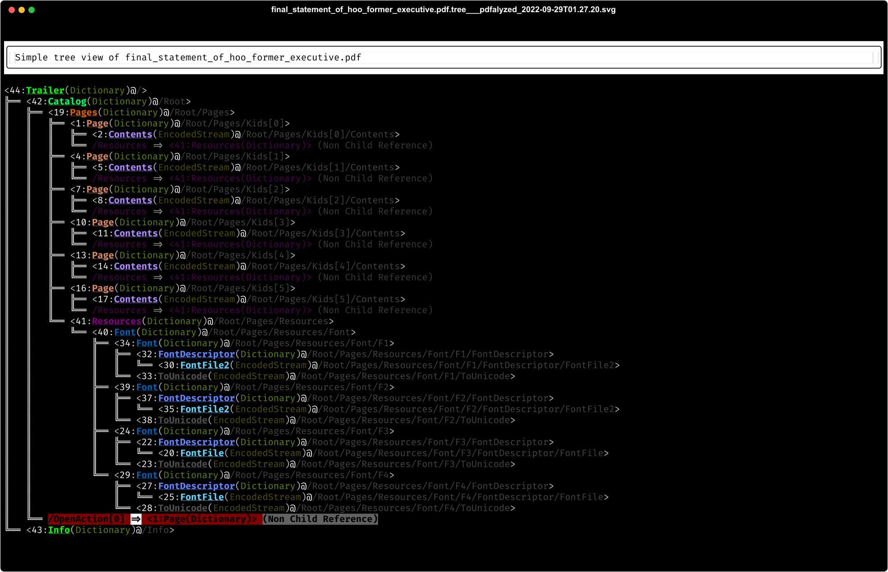
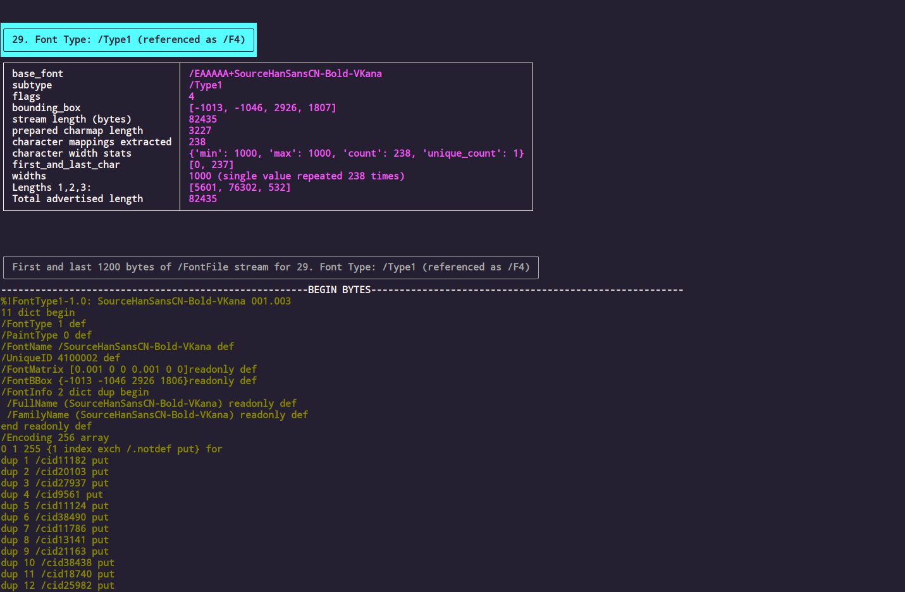
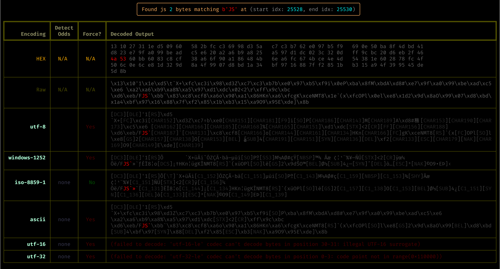
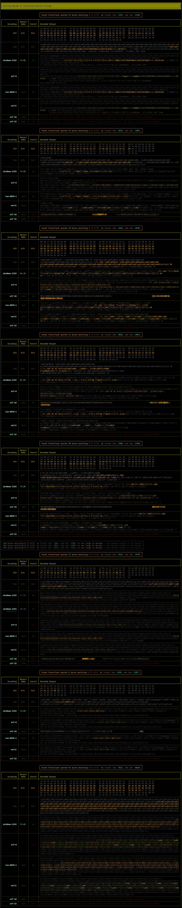
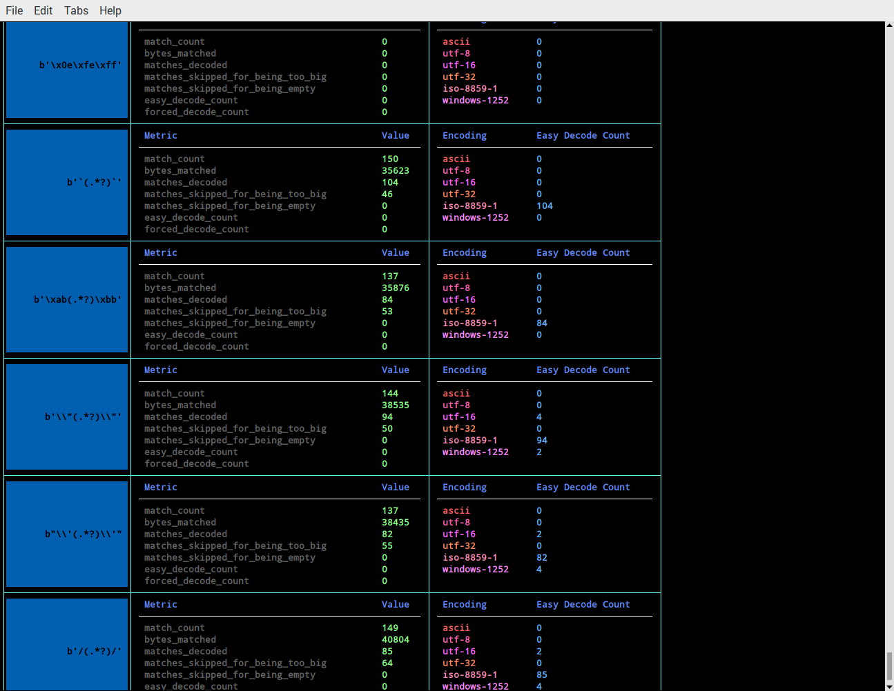
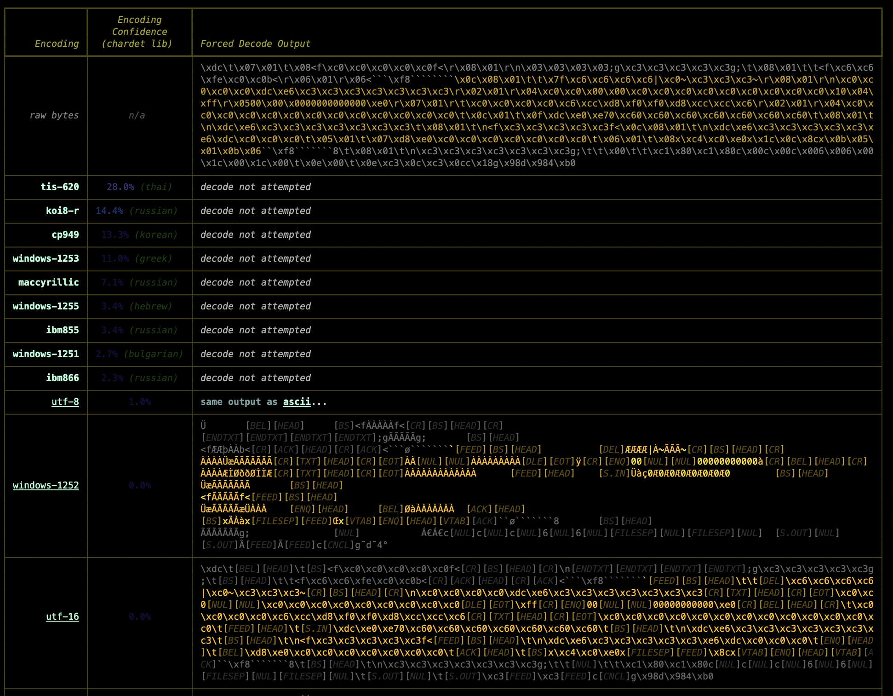
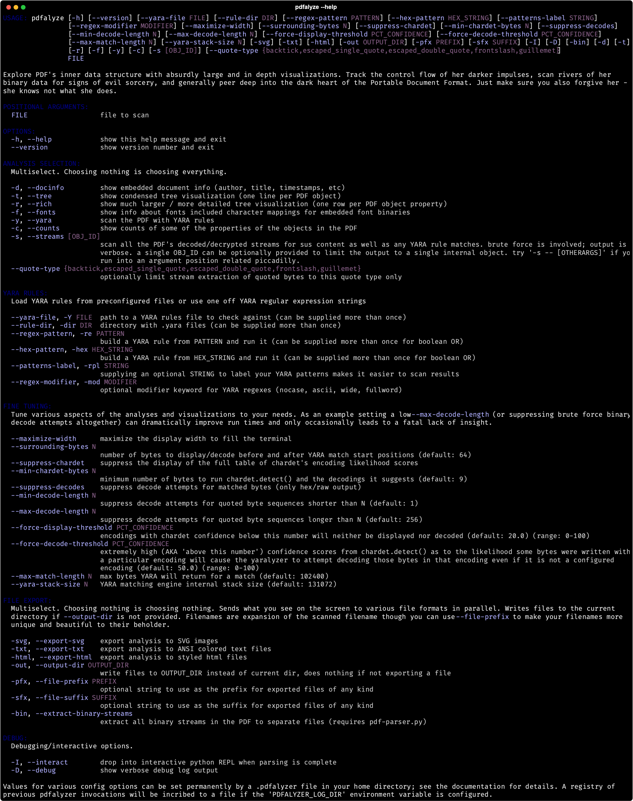

<!--  -->


# THE PDFALYZER
A PDF analysis tool geared towards visualizing the inner tree-like data structure[^1] of a PDF in [spectacularly large and colorful diagrams](#example-output) as well as scanning the binary streams embedded in the PDF for hidden potentially malicious content.

The Pdfalyzer makes heavy use of YARA (via [The Yaralyzer](https://github.com/michelcrypt4d4mus/yaralyzer)) for matching/extracting byte patterns. [The Yaralyzer](https://github.com/michelcrypt4d4mus/yaralyzer) actually began its life as The Pdfalyzer's matching engine.

**PyPi Users:** If you are reading this document [on PyPi](https://pypi.org/project/pdfalyzer/) be aware that it renders a lot better [over on GitHub](https://github.com/michelcrypt4d4mus/pdfalyzer). Lots of pretty pictures, footnotes that work, etc.

#### Quick Start
```sh
pipx install pdfalyzer
pdfalyze the_heidiggerian_themes_expressed_in_illmatic.pdf
```

### What It Do
1. **Generate in depth visualizations of a PDF's tree structure**[^1] that give you a complete picture of all of the PDF's internal objects and the links between them. See [the examples below](#example-output) to get an idea.
1. **Scan for malicious content** both with all the PDF related [YARA](https://github.com/VirusTotal/yara-python) rules I could dig up as well as in-depth scans of the embedded compressed binaries. Some tools don't decompress those binaries before scanning.
1. **Forcibly decode suspicious byte patterns with many different character encodings.** [`chardet`](https://github.com/chardet/chardet) is leveraged to attempt to guess the encoding but no matter what `chardet` thinks the results of forcing the bytes into an encoding will be displayed.
1. **Be used as a library for your own PDF related code.** All[^2] the inner PDF objects are guaranteed to be available in a searchable tree data structure.

If you're looking for one of these things this may be the tool for you.

An exception will be raised if there's any issue placing a node while parsing or if there are any nodes not reachable from the root of the tree at the end of parsing.

### What It Don't Do
This tool is mostly about examining a PDF's logical structure and assisting with the discovery of malicious content. As such it doesn't have much to offer as far as extracting text from PDFs, rendering PDFs[^3], writing new PDFs, or many of the more conventional things one might do with a portable document.

### Did The World Really Need Another PDF Tool?
This tool was built to fill a gap in the PDF assessment landscape following [my own recent experience trying to find malicious content in a PDF file](https://twitter.com/Cryptadamist/status/1570167937381826560). Didier Stevens's [pdfid.py](https://github.com/DidierStevens/DidierStevensSuite/blob/master/pdfid.py) and [pdf-parser.py](https://github.com/DidierStevens/DidierStevensSuite/blob/master/pdf-parser.py) are still the best game in town when it comes to PDF analysis tools but they lack in the visualization department and also don't give you much to work with as far as giving you a data model you can write your own code around. [Peepdf](https://github.com/jesparza/peepdf) seemed promising but turned out to be in a buggy, out of date, and more or less unfixable state. And neither of them offered much in the way of tooling for embedded binary analysis.

Thus I felt the world might be slightly improved if I strung together a couple of more stable/well known/actively maintained open source projects ([AnyTree](https://github.com/c0fec0de/anytree), [PyPDF2](https://github.com/py-pdf/PyPDF2), and [Rich](https://github.com/Textualize/rich)) into this tool.


# Example Output
The Pdfalyzer can export visualizations to HTML, ANSI colored text, and SVG images using the file export functionality that comes with [Rich](https://github.com/Textualize/rich). SVGs can be turned into `png` format images with a tool like Inkscape or `cairosvg` (Inkscape works a lot better in our experience).


### Basic Tree View
As you can see the "mad sus" `/OpenAction` relationship is highlighted bright red, as would be a couple of other suspicious PDF instructions like `/JavaScript` that don't exist in the PDF but do exist in other documents.

The dimmer (as in "harder to see") nodes[^4] marked with `Non Child Reference` give you a way to visualize the relationships between PDF objects that exist outside of the tree structure's parent/child relationships.



That's a pretty basic document. [Here's the basic tree for a more complicated PDF](doc/svgs/rendered_images/NMAP_Commands_Cheat_Sheet_and_Tutorial.pdf.tree.svg.png).

### Rich Tree View
This image shows a more in-depth view of of the PDF tree for the same document shown above. This tree (AKA the "rich" tree) has almost everything. Shows all PDF object properties, all relationships between objects, and sizable previews of any binary data streams embedded or encrypted in the document. Note that in addition to `/OpenAction`, the Adobe Type1 font binary is also red (Google's project zero regards any Adobe Type1 font as "mad sus").


[And here's the rich tree for the same more complicated PDF](doc/svgs/rendered_images/NMAP_Commands_Cheat_Sheet_and_Tutorial.pdf.rich_table_tree.png).


### Binary Analysis (And Lots Of It)
#### View the Properties of the Fonts in the PDF
Comes with a preview of the beginning and end of the font's raw binary data stream (at least if it's that kind of font).



#### Extract Character Mappings from Ancient Adobe Font Formats
It's actually `PyPDF2` doing the lifting here but we're happy to take the credit.


#### Search Internal Binary Data for Sus Content No Malware Scanner Will Catch[^5]
Things like, say, a hidden binary `/F` (PDF instruction meaning "URL") followed by a `JS` (I'll let you guess what "JS" stands for) and then a binary `»` character (AKA "the character the PDF specification uses to close a section of the PDF's logical structure"). Put all that together and it says that you're looking at a secret JavaScript instruction embedded in the encrypted part of a font binary. A secret instruction that causes the PDF renderer to pop out of its frame prematurely as it renders the font.



#### Extract And Decode Binary Patterns
Like, say, bytes between common regular expression markers that you might want to force a decode of in a lot of different encodings.



When all is said and done you can see some stats that may help you figure out what the character encoding may or may not be for the bytes matched by those patterns:




#### Now There's Even A Fancy Table To Tell You What The `chardet` Library Would Rank As The Most Likely Encoding For A Chunk Of Binary Data
Behold the beauty:



# Installation

```
pipx install pdfalyzer
```

[pipx](https://pypa.github.io/pipx/) is a tool that basically runs `pip install` for a python package but in such a way that the installed package's requirements are isolated from your system's python packages. If you don't feel like installing `pipx` then `pip install` should work fine as long as there are no conflicts between The Pdfalyzer's required packages and those on your system already. (If you aren't using other python based command line tools then your odds of a conflict are basically 0%.)

For info on how to setup a dev environment, see [Contributing](#contributing) section at the end of this file.

### Troubleshooting The Installation
1. If you encounter an error building the python `cryptography` package check your `pip` version (`pip --version`). If it's less than 22.0, upgrade `pip` with `pip install --upgrade pip`.
2. On linux if you encounter an error building `wheel` or `cffi` you may need to install some packages like a compiler for the `rust` language or some SSL libraries. `sudo apt-get install build-essential libssl-dev libffi-dev rustc` may help.
1. While `poetry.lock` is checked into this repo the versions "required" there aren't really "required" so feel free to delete or downgrade if you need to.


# Usage
Run `pdfalyze --help` to see usage instructions. As of right now these are the options:



Beyond that there's [a few scripts](scripts/) in the repo that may be of interest.

### Setting Command Line Options Permanently With A `.pdfalyzer` File
If you find yourself specificying the same options over and over you may be able to automate that with a [dotenv](https://pypi.org/project/python-dotenv/) setup. When you run `pdfalyze` on some PDF the tool will check for a file called `.pdfalyzer` first in the current directory and then in the home directory. If it finds a file in either such place it will load options from it. Documentation on the options that can be configured with these files lives in [`.pdfalyzer.example`](.pdfalyzer.example) which doubles as an example file you can copy into place and edit to your needs. Even if don't configure your own `.pdfalyzer` file you may still glean some insight from reading the descriptions of the various variables in [.pdfalyzer.example](.pdfalyzer.example); there's a little more exposition there than in the output of `pdfalyze -h`.

### Colors And Themes
Run `pdfalyzer_show_color_theme` to see the color theme employed.

### As A Code Library
At its core The Pdfalyzer is taking PDF internal objects gathered by [PyPDF2](https://github.com/py-pdf/PyPDF2) and wrapping them in [AnyTree](https://github.com/c0fec0de/anytree)'s `NodeMixin` class.  Given that things like searching the tree or accessing internal properties will be done through those packages' code it may be quite helpful to review their documentation.

As far as The Pdfalyzer's unique functionality goes, `Pdfalyzer` is the class at the heart of the operation. It holds both the PDF's logical tree as well as a couple of other data structures that have been pre-processed to make them easier to work with. Chief among these is the `FontInfo` class which pulls together various properties of a font strewn across 3 or 4 different PDF objects and the `BinaryScanner1` class which lets you dig through the raw bytes looking for suspicious patterns.

Here's a short intro to how to access these objects:

```python
from pdfalyzer.pdfalyzer import Pdfalyzer

# Load a PDF and parse its nodes into the tree.
pdfalyzer = Pdfalyzer("/path/to/the/evil.pdf")
actual_pdf_tree = pdfalyzer.pdf_tree

# Find a PDF object by its ID in the PDF
node = pdfalyzer.find_node_by_idnum(44)
pdf_object = node.obj

# Use anytree's findall_by_attr to find nodes with a given property
from anytree.search import findall_by_attr
page_nodes = findall_by_attr(pdfalyzer.pdf_tree, name='type', value='/Page')

# Get the fonts
font1 = pdfalyzer.font_infos[0]

# Iterate over backtick quoted strings from a font binary and process them
for backtick_quoted_string in font1.binary_scanner.extract_backtick_quoted_bytes():
    process(backtick_quoted_string)

# Iterate over all stream objects:
for node in pdfalyzer.stream_nodes():
    do_stuff(node.stream_data)
```


### Troubleshooting
This tool is by no means complete. It was built to handle a specific use case which encompassed a small fraction of the many and varied types of information that can show up in a PDF. While it has been tested on a decent number of large and very complicated PDFs (500-5,000 page manuals from Adobe itself) I'm sure there are a whole bunch of edge cases that will trip up the code.

If that does happen and you run into an issue using this tool on a particular PDF it will most likely be an issue with relationships between objects within the PDF that are not meant to be parent/child in the tree structure made visible by this tool. There's not so many of these kinds of object references in any given file but there's a whole galaxy of possibilities and they must each be manually configured to prevent the tool from building an invalid tree.  If you run into that kind of problem take a look at these list constants in the code:

* `NON_TREE_REFERENCES`
* `INDETERMINATE_REFERENCES`

You might be able to easily fix your problem by adding the Adobe object's reference key to the appropriate list.


# PDF Resources

### 3rd Party Tools
#### Installing Didier Stevens's PDF Analysis Tools
Stevens's tools provide comprehensive info about the contents of a PDF, are guaranteed not to trigger the rendering of any malicious content (especially `pdfid.py`), and have been battle tested for well over a decade. It would probably be a good idea to analyze your PDF with his tools before you start working with this one.

If you're lazy and don't want to retrieve his tools yourself there's [a simple bash script](scripts/install_didier_stevens_pdf_tools.sh) to download them from his github repo and place them in a `tools/` subdirectory off the project root. Just run this:

```sh
scripts/install_didier_stevens_pdf_tools.sh
```

If there is a discrepancy between the output of betweeen his tools and this one you should assume his tool is correct and The Pdfalyzer is wrong until you conclusively prove otherwise.

#### Installing The `t1utils` Font Suite
`t1utils` is a suite of old but battle tested apps for manipulating old Adobe font formats.  You don't need it unless you're dealing with an older Type 1 or Type 2 font binary but given that those have been very popular exploit vectors in the past few years it can be extremely helpful. One of the tools in the suite, [`t1disasm`](https://www.lcdf.org/type/t1disasm.1.html), is particularly useful because it decrypts and decompiles Adobe Type 1 font binaries into a more human readable string representation.

There's [a script](scripts/install_t1utils.sh) to help you install the suite if you need it:

```sh
scripts/install_t1utils.sh
```

### Documentation
#### Official Adobe Documentation
* [Official Adobe PDF 1.7 Specification](https://opensource.adobe.com/dc-acrobat-sdk-docs/standards/pdfstandards/pdf/PDF32000_2008.pdf) - Indispensable map when navigating a PDF forest.
* [Adobe Type 1 Font Format Specification](https://adobe-type-tools.github.io/font-tech-notes/pdfs/T1_SPEC.pdf) - Official spec for Adobe's original font description language and file format. Useful if you have suspicions about malicious fonts. Type1 seems to be the attack vector of choice recently which isn't so surprising when you consider that it's a 30 year old technology and the code that renders these fonts probably hasn't been extensively tested in decades because almost no one uses them anymore outside of people who want to use them as attack vectors.
* [Adobe CMap and CIDFont Files Specification](https://adobe-type-tools.github.io/font-tech-notes/pdfs/5014.CIDFont_Spec.pdf) - Official spec for the character mappings used by Type1 fonts / basically part of the overall Type1 font specification.
* [Adobe Type 2 Charstring Format](https://adobe-type-tools.github.io/font-tech-notes/pdfs/5177.Type2.pdf) - Describes the newer Type 2 font operators which are also used in some multiple-master Type 1 fonts.

#### Other Stuff
* [Didier Stevens's free book about malicious PDFs](https://blog.didierstevens.com/2010/09/26/free-malicious-pdf-analysis-e-book/) - The master of the malicious PDFs wrote a whole book about how to analyze them. It's an old book but the PDF spec was last changed in 2008 so it's still relevant.
* [Analyzing Malicious PDFs Cheat Sheet](https://zeltser.com/media/docs/analyzing-malicious-document-files.pdf) - Like it says on the tin. If that link fails there's a copy [here in the repo](doc/analyzing-malicious-document-files.pdf).
* [T1Utils Github Repo](https://github.com/kohler/t1utils) - Suite of tools for manipulating Type1 fonts.
* [`t1disasm` Manual](https://www.lcdf.org/type/t1disasm.1.html) - Probably the most useful part of the T1Utils suite because it can decompile encrypted ancient Adobe Type 1 fonts into something human readable.


# Contributing
One easy way of contributing is to run [the script to test against all the PDFs in `~/Documents`](scripts/test_against_all_pdfs_in_Documents_folder.sh) and reporting any issues.

Beyond that see [CONTRIBUTING.md](CONTRIBUTING.md).

# TODO
* highlight decodes done at `chardet`s behest
* Highlight decodes with a lot of Javascript keywords
* deal with repetitive matches


[^1]: The official Adobe PDF specification calls this tree the PDF's "logical structure", which is a good example of nomenclature that does not help those who see it understand anything about what is being described. I can forgive them given that they named this thing back in the 80s, though it's a good example of why picking good names for things at the beginning is so important.

[^2]: All internal PDF objects are guaranteed to exist in the tree except in these situations when warnings will be printed:
  `/ObjStm` (object stream) is a collection of objects in a single stream that will be unrolled into its component objects.
  `/XRef` Cross-reference stream objects which hold the same references as the `/Trailer` are hacked in as symlinks of the `/Trailer`

[^3]: Given the nature of the PDFs this tool is meant to be scan anything resembling "rendering" the document is pointedly NOT offered.

[^4]: Technically they are `SymlinkNodes`, a really nice feature of [AnyTree](https://github.com/c0fec0de/anytree).

[^5]: At least they weren't catching it as of September 2022.

